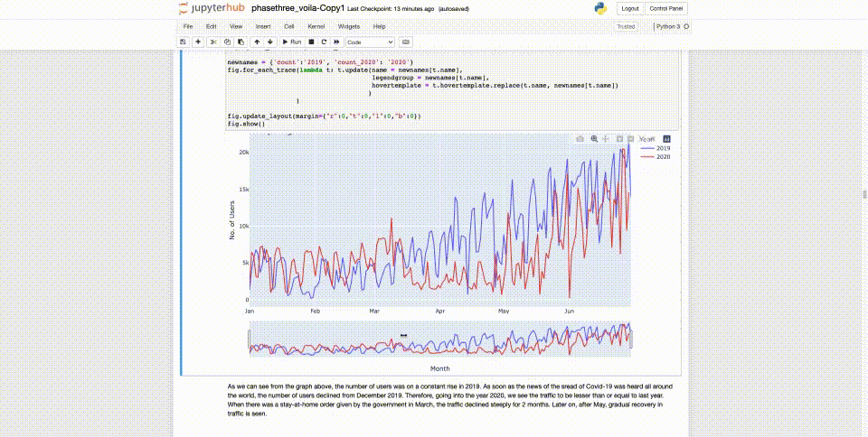
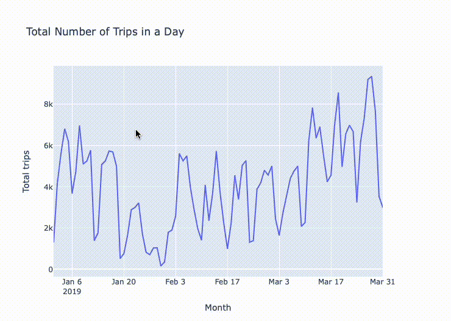
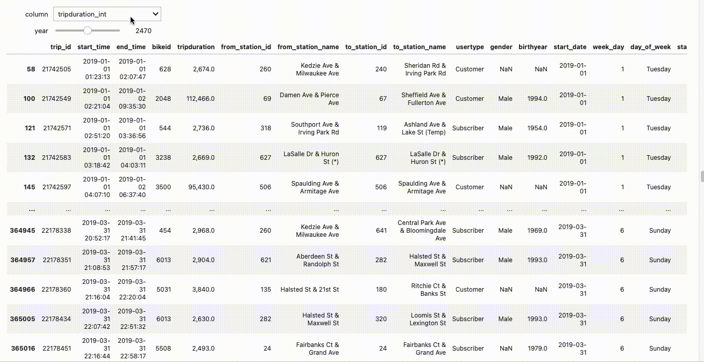

# Data-visualization-voila

## Visualization of Divvy Bike Share System
[Divvy](https://divvybikes.com) is a Chicagoland’s bike share system which located across Chicago and Evanston. Divvy provides thr residents and thr tourists in Chicago with a convenient, fun, and affordable transportation option for getting around and exploring Chicago. 

We decided to explore the data Divvy provideed, and made some visualizations and interactive plots for this dataset.

### Phase 1
We explored the dataset in phase 1, `phase_one.ipynb`.

### Phase 2
The second component of your project will be to design the "observatory". These consist of drawings, prototypes of web pages or notebooks, and the code necessary to build the different components. This component is scaffolding, not the final product. It's thought of as the "viz for peers" stage of the process. 

Check file - `FinalProject-PhaseTwo-GroupA.ipynb`

### Phase 3
I decided to deploy the interactive dashboard with **voila**. Code is in file `IS445_Final Project _Phase Three_Group A.ipynb`. The website runs successfully with voila and the final results with interactive visualizations!

## Prerequisite
0. install [voila](https://voila.readthedocs.io/en/stable/install.html) in your computer.

## Steps by steps

1. Use `voila name.ipynb` to run voila.

2. It will automatically open a new website in the broswer to see the interactive page. It will take few seconds.

3. Scroll down to explore what you have got in our website.

4. Famous station in the dataset.

5. Number of users from 2019 to 2020.

4. Total number of trips in a day.

5. Filter **birthyear** column of the dataset.

6. Filter with column **trip_duration, birthyear, bikeid** of the dataset.

7. Count of price category in 2019.

8. Percentage of price category in 2019.

9. 2019 Q1 Daily Trip Duration.

10. 2020 Q1 Daily Trip Duration.

## Result
Check the voila output with `output` file.

> Note: it is export as pdf file and cannot have any interaction.

